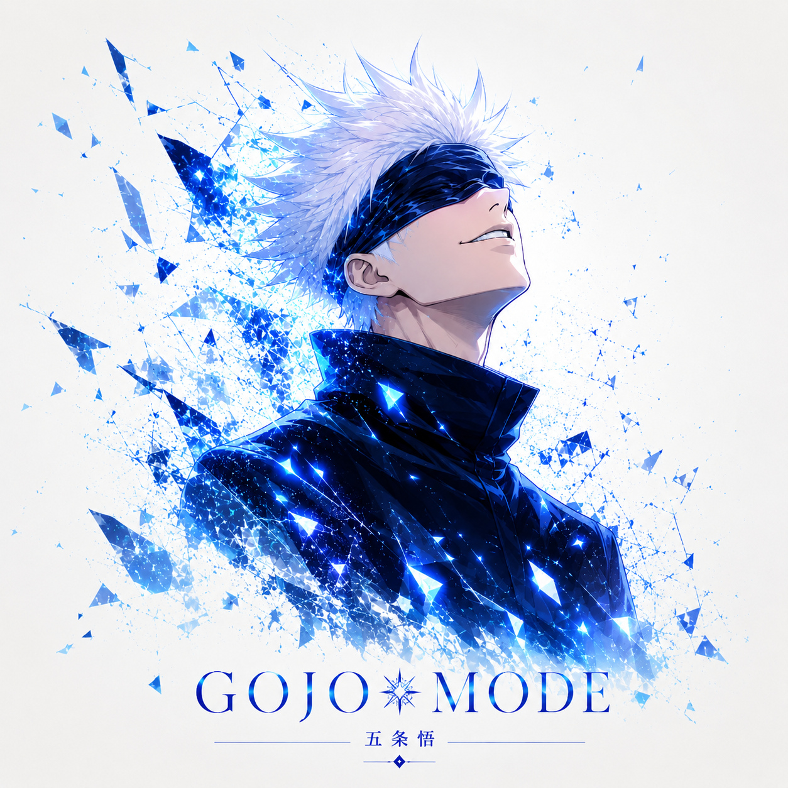

  

<h1 align="center"><code>root@vimal:~# whoami</code></h1>

  
  
  

  
  
  

🟢 root@vimal:~/profile# cat about.txt

<table>
<tr>
<td width="64%" valign="top">

┌──(vimal㉿github)-[~/profile]
└─$ whoami

Name      : Vimal G
Role      : Final-Year B.E. Cyber Security Student
College   : Mahendra Engineering College (Autonomous)

Focus     : Cybersecurity | Zero Trust | EDR
Current   : Java Full Stack Training
Exploring : RAG | LangChain | Gemini 2.5 Flash
Systems   : Windows | Ubuntu | Kali Linux | Qubes OS
Goal      : Build secure systems and practical security products
Status    : [ ONLINE ]

</td>
<td width="36%" align="center" valign="middle">

</td>
</tr>
</table>

🔵 root@vimal:~/skills# ./scan-stack.sh

  

[+] PROGRAMMING
    ├── Python
    ├── Java
    └── SQL

[+] WEB
    ├── HTML
    ├── CSS
    ├── JavaScript
    └── React

[+] BACKEND
    ├── Flask
    ├── FastAPI
    └── WebSockets

[+] DATABASE
    ├── MySQL
    ├── PostgreSQL
    └── Redis

[+] CYBERSECURITY
    ├── OWASP ZAP
    ├── SQL Injection Testing
    ├── Zero Trust
    ├── EDR Concepts
    └── MITRE ATT&CK

[+] AI / ML
    ├── RAG
    ├── LangChain
    ├── Gemini 2.5 Flash
    └── Machine Learning

[+] TOOLS / OS
    ├── Git / GitHub
    ├── VS Code / Eclipse
    └── Windows / Ubuntu / Kali / Qubes OS

🟣 root@vimal:~/projects# ls -la

🛡️ $ ./zero-trust-edr

STATUS      : IN DEVELOPMENT
TYPE        : Endpoint Security Platform

FEATURES    :
  [+] Endpoint Telemetry
  [+] Dynamic Detection Rules
  [+] Risk-Based Alerting
  [+] RBAC
  [+] SOC Monitoring
  [+] Automated Response Workflows

STACK       :
  Python | FastAPI | React | PostgreSQL
  Redis | WebSockets | MITRE ATT&CK

🤖 $ ./learn-sphere-ai

TYPE        : AI Personalized Learning Platform
AI          : Gemini 2.5 Flash | RAG | LangChain

FEATURES    :
  [+] Context-Aware Tutoring
  [+] Conversation Memory
  [+] Learning Roadmaps
  [+] Progress Tracking

STACK       :
  Python | Flask | HTML | CSS | JavaScript

🔐 $ ./ransomware-detection

TYPE        : ML-Based Ransomware Detection
MODELS      : Decision Tree | MLP

FEATURES    :
  [+] Behavioral Analysis
  [+] File-System Monitoring
  [+] Entropy Analysis
  [+] Automated Quarantine

STACK       :
  Python | Flask | Scikit-learn
  psutil | Watchdog | NumPy

🟡 root@vimal:~/github# ./stats.sh

  
  

  

🟠 root@vimal:~/activity# tail -f contributions.log

  

🔴 root@vimal:~/gojo-mode# ./activate.sh

<table>
<tr>
<td width="35%" align="center" valign="middle">

</td>
<td width="65%" valign="middle">

[ SYSTEM ] Gojo Mode Activated

STATUS  : ENABLED
MODE    : Always Learning
FOCUS   : Build > Secure > Improve > Repeat

"Throughout heaven and earth,
 I alone am the honored one."

</td>
</tr>
</table>

🟢 root@vimal:~/contact# cat social.conf

GITHUB   = github.com/vimalrootben
LINKEDIN = linkedin.com/in/vimal-g
EMAIL    = vimalcyberackerman@gmail.com
BLOG     = vimaltechhub.blogspot.com

  
  
  

root@vimal:~# echo "Building secure systems. Protecting data. Exploring AI. Learning every day."

<b>⚡ BUILD • SECURE • LEARN • REPEAT ⚡</b>

