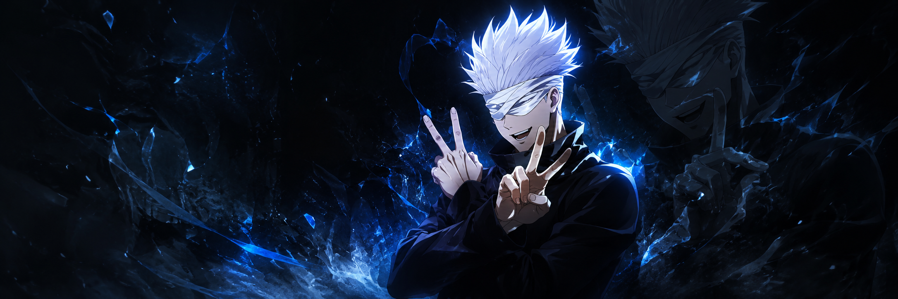
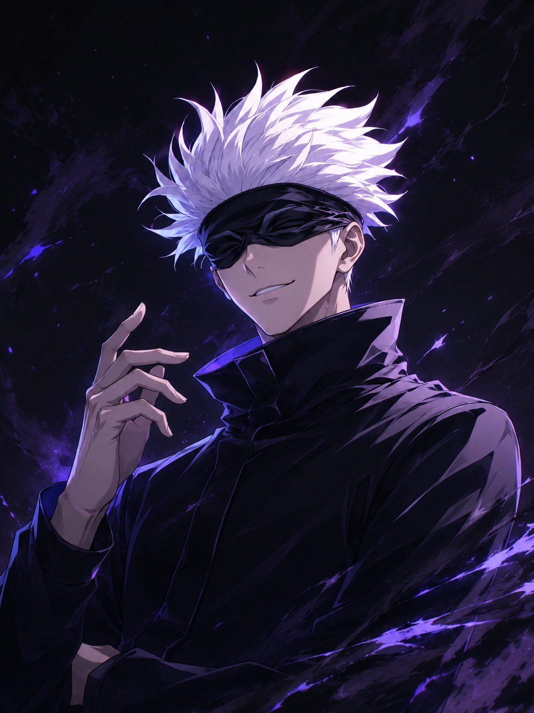

  

<h1 align="center">👋 Hi, I'm Vimal G</h1>

  <b>Final-Year B.E. Cyber Security Student</b> 
  Cybersecurity • Java Full Stack • AI / LLM

  
  

🔗 About Me

<table>
<tr>
<td width="62%" valign="top">

Hey! I'm Vimal G, a final-year B.E. Cyber Security student at Mahendra Engineering College (Autonomous).

I enjoy building projects around endpoint security, Zero Trust, full-stack development, and AI/LLM applications.

🔐 Focus: Cybersecurity, Zero Trust, EDR

💻 Current: Java Full Stack training

🤖 Exploring: RAG, LangChain, Gemini 2.5 Flash

🐧 Systems: Windows, Ubuntu, Kali Linux, Qubes OS

🌱 Goal: Build practical security products and keep learning

</td>
<td width="38%" align="center" valign="middle">

</td>
</tr>
</table>

🛠 Languages • Frameworks • Tools

  

<table>
<tr>
<td><b>Programming</b></td>
<td>Python • Java • SQL</td>
</tr>
<tr>
<td><b>Web</b></td>
<td>HTML • CSS • JavaScript • React</td>
</tr>
<tr>
<td><b>Backend</b></td>
<td>Flask • FastAPI • WebSockets</td>
</tr>
<tr>
<td><b>Databases</b></td>
<td>MySQL • PostgreSQL </td>
</tr>
<tr>
<td><b>Cybersecurity</b></td>
<td>OWASP ZAP • SQL Injection Testing • Zero Trust • MITRE ATT&CK</td>
</tr>
<tr>
<td><b>AI / ML</b></td>
<td>RAG • LangChain • Gemini 2.5 Flash • Machine Learning</td>
</tr>
<tr>
<td><b>Tools / OS</b></td>
<td>Git • GitHub • VS Code • Eclipse • Windows • Ubuntu • Kali Linux • Qubes OS</td>
</tr>
</table>

🚀 Featured Projects

🛡️ Zero Trust EDR & Continuous Authentication Platform

Status: IN DEVELOPMENT

Real-time endpoint security platform with endpoint telemetry, dynamic rules/policies, risk-based alerting, RBAC, SOC monitoring and automated response workflows.

Python FastAPI React PostgreSQL Redis WebSockets MITRE ATT&CK

🧠 Learn Sphere AI — Personalized Learning Platform

AI-powered personalized learning platform using Gemini 2.5 Flash, RAG, and LangChain for contextual tutoring, learning roadmaps, conversation memory and progress tracking.

Python Flask Gemini 2.5 Flash RAG LangChain HTML CSS JavaScript

🔐 Ransomware Detection System

Real-time ransomware detection using behavioral analysis, Decision Tree + MLP classifiers, file-system monitoring, entropy analysis and automated quarantine.

Python Flask Scikit-learn psutil Watchdog NumPy

📊 GitHub Stats

  
  

  

🌌 Gojo Mode

<table>
<tr>
<td width="35%" align="center" valign="middle">

</td>
<td width="65%" valign="middle">

<h2>"Throughout heaven and earth, i alone am the honored one"</h2>

                                         <h3> -satoru Gojo </h3>

Mode: Always learning 
Focus: Build → Secure → Improve → Repeat

</td>
</tr>
</table>

🤝 Connect With Me

  
  

  <b>Building secure systems. Protecting data. Exploring AI. Learning every day.</b>

