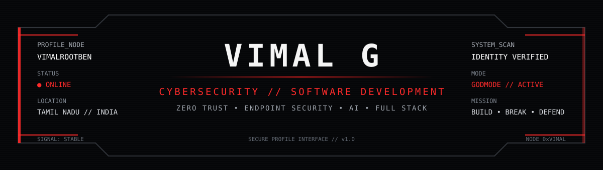
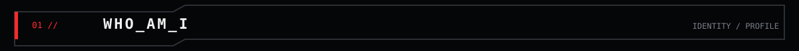
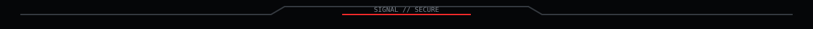
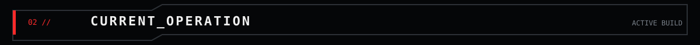
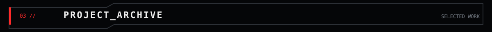
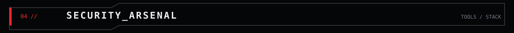
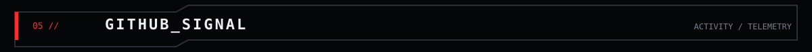
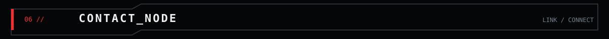

<p align="center">
  
</p>

<p align="center">
  <a href="https://www.linkedin.com/in/vimalcyber">
    
  </a>
  <a href="https://vimaltechhub.blogspot.com">
    
  </a>
</p>

<p align="center">
  
</p>



```text
> USER              : VIMAL G
> HANDLE            : @vimalrootben
> ROLE              : FINAL-YEAR B.E. CYBER SECURITY STUDENT
> TRAINING          : JAVA FULL STACK
> LOCATION          : TAMIL NADU, INDIA
> CURRENT FOCUS     : ZERO TRUST / EDR / REAL-TIME SECURITY SYSTEMS
> STATUS            : ONLINE
```

Final-year Cyber Security student undergoing Java Full Stack training, with working knowledge of **Python** and **SQL**. I build web and security-focused systems using **HTML, CSS, JavaScript, Flask, FastAPI, React, PostgreSQL, Redis, WebSockets, Linux and Git**.

My current work focuses on a **Zero Trust EDR & Continuous Authentication Platform**, including endpoint telemetry, detection rules, risk-based alerting, RBAC, SOC monitoring, network visibility and automated endpoint response.

> **CAUTION //**  
> Code is never finished. Security is never static.  
> Build → observe → detect → respond → improve.





### `ZERO_TRUST_EDR // ACTIVE`

```text
┌─ OPERATION STATUS ───────────────────────────────────────────────────┐
│ PROJECT      : Zero Trust EDR & Continuous Authentication Platform │
│ STATE        : DEVELOPMENT / ACTIVE                                 │
│ TELEMETRY    : ENDPOINT PROCESS + NETWORK + SECURITY EVENTS         │
│ DETECTION    : DYNAMIC RULES / POLICIES / RISK-BASED ALERTING       │
│ RESPONSE     : ISOLATE / LOCK / LOGOUT / QUARANTINE                 │
│ ACCESS       : RBAC + SOC MONITORING                                │
│ MAPPING      : MITRE ATT&CK                                         │
└─────────────────────────────────────────────────────────────────────┘
```

**Stack:** `Python` `FastAPI` `React` `PostgreSQL` `Redis` `WebSockets` `MITRE ATT&CK`

**Mission:** Build a real-time endpoint security platform that collects endpoint telemetry, evaluates security risk, generates actionable alerts and supports automated response workflows.



<table>
<tr>
<td width="33%" valign="top">

### `01 // ZERO TRUST EDR`
**Status:** `ONGOING`

Real-time endpoint security platform with telemetry collection, risk-based alerting, RBAC, SOC monitoring and automated response workflows.

`Python` `FastAPI` `React` `PostgreSQL` `Redis`

</td>
<td width="33%" valign="top">

### `02 // LEARNSPHERE AI`
**Status:** `BUILT`

Personalized learning platform using Gemini 2.5 Flash, RAG and LangChain for context-aware conversational tutoring, memory, roadmaps and progress tracking.

`Python` `Flask` `Gemini` `RAG` `LangChain`

</td>
<td width="33%" valign="top">

### `03 // RANSOMWARE DETECTOR`
**Status:** `BUILT`

Ubuntu ransomware detection system using behavioral process analysis with Decision Tree and MLP classifiers, filesystem monitoring, entropy analysis and automated quarantine.

`Python` `Flask` `Scikit-learn` `psutil` `Watchdog`

</td>
</tr>
</table>



<p align="center">
  
</p>

```text
[ PROGRAMMING ]  Python • Java
[ DATABASE    ]  SQL • MySQL • PostgreSQL 
[ WEB         ]  HTML • CSS • JavaScript • Flask • FastAPI 
[ SECURITY    ]  Zero Trust • Endpoint Telemetry • SQL Injection Testing
                 OWASP ZAP • MITRE ATT&CK
[ TOOLS       ]  Git • GitHub • VS Code • Eclipse • WebSockets • Watchdog • psutil
[ SYSTEMS     ]  Ubuntu • Kali Linux • Qubes OS • Windows
```



<!-- ===================== GITHUB SIGNAL ===================== -->

<table align="center">
<tr>

<td align="center" width="50%">
  
</td>

<td align="center" width="50%">
  
</td>

</tr>
</table>


<p align="center">
  
</p>


<p align="center">
  
</p>



<p align="center">
  <a href="https://www.linkedin.com/in/vimalcyber">
    
  </a>
  <a href="https://vimaltechhub.blogspot.com">
    
  </a>
</p>

```text
> SCAN COMPLETE
> IDENTITY       : VIMAL G
> SIGNAL         : STABLE
> CURRENT MODE   : LEARN / BUILD / SECURE
> NEXT OBJECTIVE : SHIP BETTER SYSTEMS
```

<p align="center">
  
</p>

<p align="center">
  <sub>VIMAL_G // CYBERSECURITY × DEVELOPMENT // SYSTEM ONLINE</sub>
</p>
